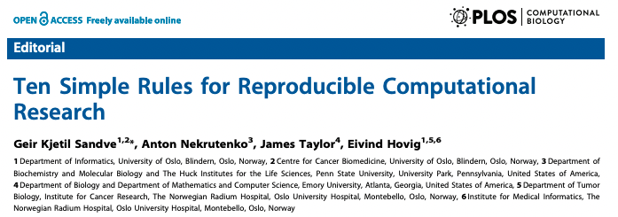
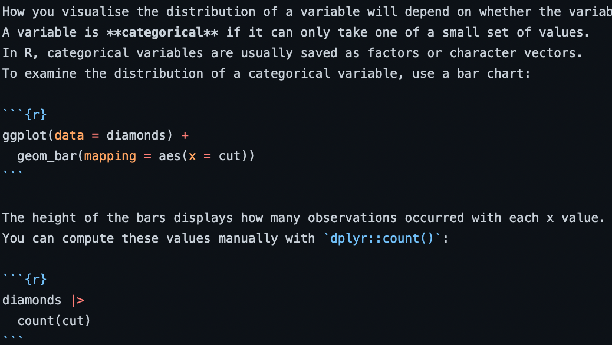
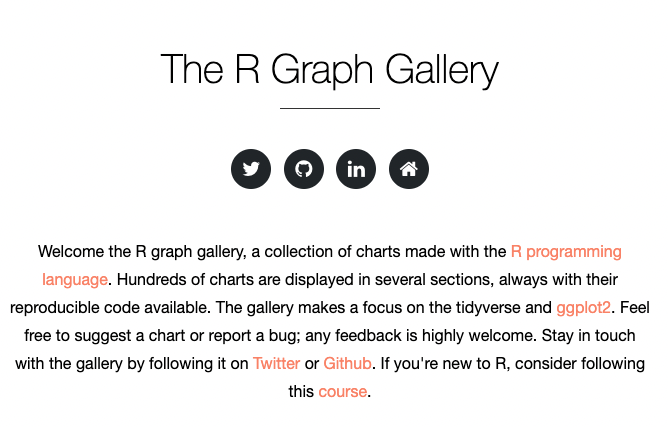
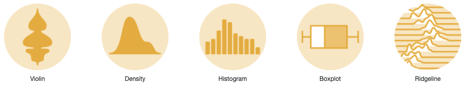
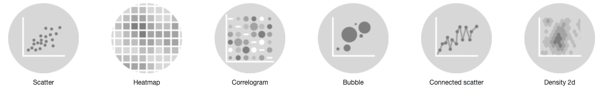
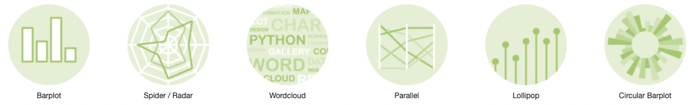
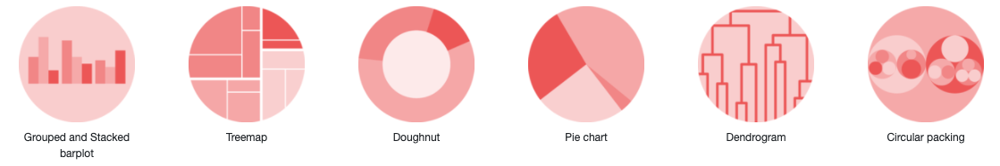
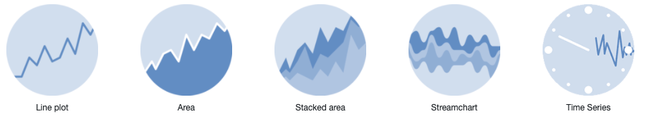
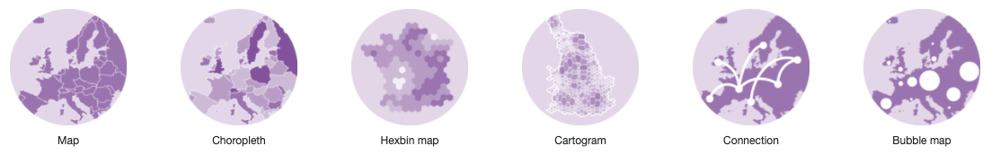
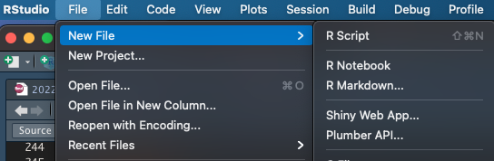

```{r setup, include=FALSE}
library(knitr)
options(width=50)
```

# What is EDA?

## What is Exploratory Data Analysis?

Exploratory Data Analysis, or EDA, is an important step in any Data Analysis or Data Science project. 

EDA is the process of investigating the dataset to:

- discover patterns within and between variables
- find anomalies and outliers
- form hypotheses based on our understanding of the dataset

## Getting started with EDA

Start by: 

### Define the toolkit

Multiple toolkits are available for data analysis. In our case, we will
be using R, but others might use python, Spark, Julia, Perl, or others.

### Access and load data

Accessing and loading data can sometimes be a challenge, 
but a good toolkit will provide 
solutions for common data formats and types.

## EDA is an iterative process

1. Generate questions about your data. 
2. Search for answers by:
   - Visualizing data
   - Summarizing data
   - Transforming data
3. Refine your questions, generate new questions, and then repeat from step

## EDA is a mindset

{width=400px}

## EDA is a mindset

- Exploratory data analysis is about playing with data. 
- Curiosity and patience both play a part in successful EDA.
- There is not a set of rules for EDA. 
- Collaboration and communication can add to the fun of EDA.
- As a data analysts or bioinformatician, sometimes EDA can lead to having to deliver bad news (failed experiment, lack of data to answer a question)

## Reproducible research benefits from well-documented EDA

Reproducible computational research is a goal that we all aspire to [@Sandve2013-im]. 

{width=400px}

While perhaps a bit beyond the scope of this lecture, your future self will thank you if you carefully document your EDA to aid in reproducibility and reuse. R markdown is a great way to accomplish this. 

## Approach EDA as a lab notebook for data

{width=400px}

# Questions guide EDA

## Guide EDA with questions

> "There are no routine statistical questions, only questionable statistical routines." --- Sir David Cox

> 

> "Far better an approximate answer to the right question, which is often vague, than an exact answer to the wrong question, which can always be made precise." --- John Tukey


## Ask lots of questions of data

- A key to understanding data and generating new insight from them is to ask **lots** of questions.
- Document your questions and their answers, including the _how_ *and* the _why_.
- Use the answer to previous questions to generate new ones.
- Some questions may be in the form of a _hypothesis_ to be tested, but many will not.


## Answer two key questions to ask in EDA

### What is the _variation_ in each of my variables, individually?
Every variable has its own pattern of variation, which can reveal interesting information including quality issues like outliers. 

### What is the _covariation_ between my variables?
Covariation is the tendency for the values of two or more variables to vary together in a related way.


# EDA employs visualation

## Visualization is a key component of EDA



See [The R Graph Gallery](https://r-graph-gallery.com/) for an interactive 
web gallery of approaches to graphing data. 

## Graphs can help answer questions about data.

### Distributions of a single variable


### Showing relationships between variables


## Choosing the right graph conveys a story about the data

### Showing rankings or proportions


### Parts of a whole


## Some graphs are very specific

### Time-ordered data


### Maps and spatial data


# A practical example of EDA.

## Pick a dataset that interests you

We'll be working with the dataset described here:  [https://ggplot2.tidyverse.org/reference/mpg.html](https://ggplot2.tidyverse.org/reference/mpg.html). Since this is a dataset that comes with the `ggplot2` package, you could also use this code to get details:

```{r eval=FALSE}
library(ggplot2)
help('mpg')
```

### Dataset description
This dataset contains a subset of the fuel economy data that the EPA makes available on https://fueleconomy.gov/. It contains only models which had a new release every year between 1999 and 2008 - this was used as a proxy for the popularity of the car.


## Load data and start exploring

```{r}
library(ggplot2)
data(mpg)
```

What are the variable names? 

```{r}
colnames(mpg)
```

How big are the data?

```{r}
dim(mpg)
```

## What are the types of data in `mpg`?


```{r}
sapply(mpg, class)
```

## We can quickly summarize the data in `mpg`

```{r}
summary(mpg)
```

## We can get a glimpse of the values in `mpg`

```{r message=FALSE}
library(tidyverse)
glimpse(mpg)
```

## The `manufacturer` variable is categorical

```{r}
unique(mpg$manufacturer)
```

```{r}
table(mpg$manufacturer)
```

## We can visualize categorical variable distribution using barplots

```{r fig.height=4}
ggplot(mpg,mapping = aes(x = manufacturer)) +
  geom_bar()
```

## We can visualize continuous variables using histograms

```{r fig.height=4}
ggplot(mpg, mapping = aes(x = cty)) +
  geom_histogram(bins=20) + ggtitle('MPG in the City')
```

## We can visualize continuous variables using histograms

```{r fig.height=4}
ggplot(mpg, mapping = aes(x = hwy)) +
  geom_histogram(bins=20) + ggtitle('MPG on the Highway')
```


## Some numeric variables are also categorical

```{r fig.height=4}
ggplot(mpg, mapping = aes(x = cyl)) +
  geom_bar()
```

## Use a scatterplot to relate two numeric variables

```{r fig.height=4}
ggplot(mpg, mapping = aes(x = cty, y=hwy)) +
  geom_point()
```

## Use a boxplot for a categorical and numeric variable

```{r fig.height=4}
ggplot(mpg, mapping = aes(x = manufacturer, y=hwy)) +
  geom_boxplot()
```

# Using Rmarkdown as an EDA notebook

## Start with a blank Rmarkdown



## Use Rmarkdown headers to organize your thoughts

- Introduction and background
- Dataset(s)
  - include lots of descriptive plots and tables
- Results
  - ask and answer questions here
- Conclusions (can also go with the questions and answers)
- Future work and extensions
  - Document questions that you think you'd like to answer later, including why.
- Use headers for questions


## Additional Rmarkdown tips

- Use R blocks to write R code
- `knit your rmarkdown` regularly to check for errors and results
- Use the R console to try and perfect code and then add to the Rmarkdown document
- Don't forget to explain in text your rationale for asking a question of your data
- Don't forget to write down your explanation of your findings, knowing that your _future self_ is a key reader
- As your EDA notebook grows, you may find that splitting into multiple files becomes necessary

# Summary

## Further reading

- [Hadley Wickham's R for Data Science Book](https://r4ds.had.co.nz/)
- [MANY Youtube videos on Exploratory Data Analysis in R](https://www.google.com/search?q=youtube+exploratory+data+analysis+in+R&oq=youtube+exploratory+data+analysis+in+R)
- Other R packages to try:
  - [GGally](https://cran.r-project.org/package=GGally) and the `ggpairs()` function
  - [DataExplorer](https://cran.r-project.org/package=DataExplorer)
  - [SmartEDA](https://cran.r-project.org/package=SmartEDA)

## SmartEDA example

```{r eval=FALSE}
# install.packages('SmartEDA')
library(SmartEDA)
library(dplyr)
diamonds %>% 
  sample_frac(0.05) %>%
  ExpReport(
  label=NULL,
  op_file="diamond_report.html",
  op_dir=getwd())
```

